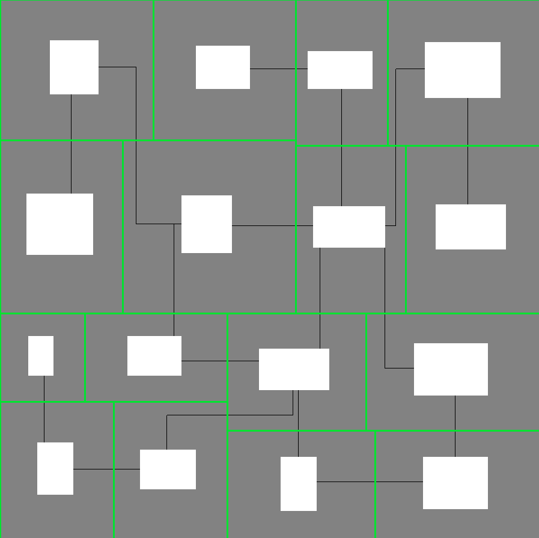

[<- Readme](README.md)

# Manual

The following guide details the methods used to generate terrain and what parameter are available to customize the generator.

## Example

```c
#include "procgen.h"

int main(void)
{
    procgen_t pg = {0};
    vec2_t size = {300, 300};

    pg.split_settings = (bsp_split_settings_t) {
        .splits = 4,
        .max_ratio = 2.7,
        .same_split_percent = 0
    };
    pg.room_settings = (bsp_room_settings_t){
        .max_ratio = 1.3,
        .min_coverage_percent = 10,
        .max_coverage_percent = 20,
        .spacing_scale = 1
    };
    pg.corridor_settings = (bsp_corridor_settings_t){
        .room_link_min_touch = 10,
        .cycling_rate = 0.1
    };
    pg.automaton_settings = (automaton_settings_t){
        .iterations = 0,
        .noise_on_percent = 70,
        .cell_on_minimum_neighbors = 5,
        .corridor_inner_size = 5,
        .corridor_outer_size = 10,
        .room_outline_size = 3,
        .apply_flood_fill = true
    };

    srand(time(NULL)); // random seed using current time
    procgen_generate(&pg, size);

    // use generated map here (pg.automaton.map)

    procgen_deinit(&pg);
    return 0;
}
```

## Parameters

Parameters are divided into 4 structures which coincide with the four steps of the generation.

- **split** (*split_settings_t*)
    - **splits** (int): The number of split to recursively apply to the initial rectangle (1 split = 2 rooms, 2 splits = 4 rooms, 3 splits = 8 rooms ...).
    - **max_ratio** (float): The maximum ratio between the width and length of the sub-rectangles created when splitting (green rectangles in the images). 2.0 means that the width can be 2x bigger that the height at most or vice-versa. This parameter prevents splits that make the resulting rectangles' dimensions too uneven.
    - **same_split_percent** (int): The chance in percentage that the next split will have the same orientation as the previous one. Having it at 0 means that if the previous split was horizontal, the next one has to be vertical.
- **room** (*room_settings_t*)
    - **max_ratio** (float): Same as the one from above but instead of being for the sub-rectangle created by a split, it is for the rectangle placed inside that represent the actual room (white rectangles in the images).
    - **min_coverage_percent** (int): The minimum percentage of space within the split rectangle that is occupied by a room rectangle.
    - **max_coverage_percent** (int): The maximum percentage of space within the split rectangle that can be occupied by a room rectangle.
    - **spacing_scale** (float): The scale of padding to add when placing the room rectangle (i.e. 0.0 means the room can be placed anywhere inside the split rectangle and 1.0 means it will always be centered, the closer to 1 the more centered it is).
- **corridor** (*corridor_settings_t*)
    - **room_link_min_touch** (int): The minimum of space (in unit/cells) of 2 rectangles for a corridor between them to be possible.
    - **cycling_rate** (float): The rate of cycling links to add when creating the corridors path. (0.0 means the path is never cyclic and 1.0 means that all possible corridor will be created)
- **automaton** (*automaton_settings_t*)
    - **iterations** (int): The number of iterations to perform.
    - **noise_on_percent** (int): The percentage of cells to toggle when placing random cells. Does not affect immutable cells.
    - **cell_on_minimum_neighbors** (int): The minimum number of neighbors that are on required for a cell to be considered on as well.
    - **corridor_inner_size** (int): The thickness in cells of the corridors. Uses immutable cells.
    - **corridor_outer_size** (int): The thickness in cells of the outside of corridor to clear. Replaces immutable cells with mutable ones.
    - **room_outline_size** (int): The thickness in cells of the outline of split-rectangles. This helps avoiding unplanned openings between rooms created because of the automaton.
    - **apply_flood_fill** (bool): If set to true, a flood fill will be applied at the end of the generations to cover isolated areas.

## How it works

There are two main algorithms used when generating terrain:
- **Binary Space Partitioning**

    [Binary Space Partitioning](https://en.wikipedia.org/wiki/Binary_space_partitioning) (BSP) is used to create the rooms layout. It works by basically splitting a rectangle recursively, generating a binary tree with the sub-rectangles. Then, smaller rectangles are placed in each leaf which represent the actual rooms.
    
    <center></center>

    During the creation of the binary tree, a [half-edge data structure](https://en.wikipedia.org/wiki/Doubly_connected_edge_list) is created to know which rooms are adjacents.

    <center></center>

    Then, [Kruskal algorithm's](https://en.wikipedia.org/wiki/Kruskal%27s_algorithm) is used to randomly connect adjacent rooms until all rooms are connected without any loops in the path.

    <center></center>
    
    Finally, corridors are placed between connected rooms with some manually added looping.
    
    <center></center>

- **Cellular Automata**

    A [cellular automaton](https://en.wikipedia.org/wiki/Cellular_automaton) is used to build organic-looking terrain around the computed rooms and corridors.

    Usually cellular automaton's cells have only two states, Alive & Dead (On & Off), such as [Conway's Game of Life](https://en.wikipedia.org/wiki/Conway%27s_Game_of_Life) or [Wolfram's elementary cellular automaton](https://en.wikipedia.org/wiki/Elementary_cellular_automaton). However here, two additional states are introduced which are interpreted just like the first two, but cannot change during iterations of the automaton. Pierre calls them *definitively alive* and *definitively dead* cells.
    
    When initializing the automaton, rooms and corridors are set to definitively alive while the outlines of the bsp rectangles are set to definitively dead, the rest is randomly set to either alive or dead.

    <center></center>
    
    The automaton is then run for a set number of iterations with user-defined rules for transitioning between alive and dead.
    
    <center></center>

    Generation is highly customizable to obtain unique and varied results.

    <center></center>

[<- Readme](README.md)
